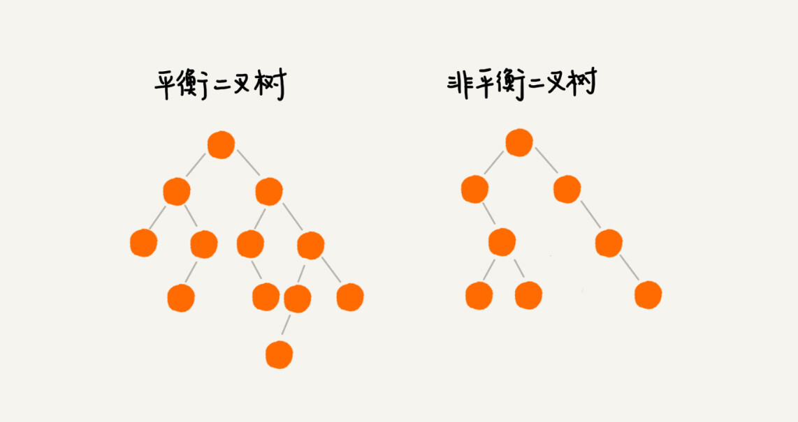

# 红黑树

二叉查找树是最常用的一种二叉树，它支持快速插入、删除、查找操作，各个操作的时间复杂度跟树的高度成正比，理想情况下，时间复杂度是 O(logn)。

不过，二叉查找树在频繁的动态更新过程中，可能会出现树的高度远大于 log2n 的情况，从而导致各个操作的效率下降。极端情况下，二叉树会退化为链表，时间复杂度会退化到 O(n)。

我上一节说了，要解决这个复杂度退化的问题，我们需要设计一种**平衡二叉查找树**，也就是今天要讲的这种数据结构。

## 平衡二叉查找树

二叉树中任意一个节点的左右子树的高度相差不能大于1.

完全二叉树都是平衡的二叉树,但并非所有的平衡二叉树都是完全二叉树.

平衡二叉查找树的初衷是，解决普通二叉查找树在频繁的插入、删除等动态更新的情况下，出现时间复杂度退化的问题。

## 红黑树

在平衡二叉树中,更多出现的是红黑树,除此之外还有Splay Tree(伸展树) ,Treap(树堆)等.

顾名思义,红黑树的节点一类标记为黑色,一类标记为红色,除此之外,红黑树还需要满足下面这样几个要求:

1. 根节点是黑色的
2. 每个叶子节点都是黑色的空节点,也就是说叶子节点不存储数据
3. 任何相邻的节点都不能同时为红色,但是黑色的节点可以相邻
4. 每个节点从该节点到达可达的叶子结点所有的路径中,都包含相同数目的黑色节点.

红黑树(Red-Black Tree,R-B Tree)是一种不严格的平衡二叉树.

## 红黑树与AVL树的取舍

AVL 树是一种高度平衡的二叉树，所以查找的效率非常高，但是，有利就有弊，AVL 树为了维持这种高度的平衡，就要付出更多的代价。

每次插入、删除都要做调整，就比较复杂、耗时。所以，对于有频繁的插入、删除操作的数据集合，使用 AVL 树的代价就有点高了。

红黑树只是做到了近似平衡，并不是严格的平衡，所以在维护平衡的成本上，要比 AVL 树要低。所以，红黑树的插入、删除、查找各种操作性能都比较稳定。

对于工程应用来说，要面对各种异常情况，为了支撑这种工业级的应用，我们更倾向于这种性能稳定的平衡二叉查找树。