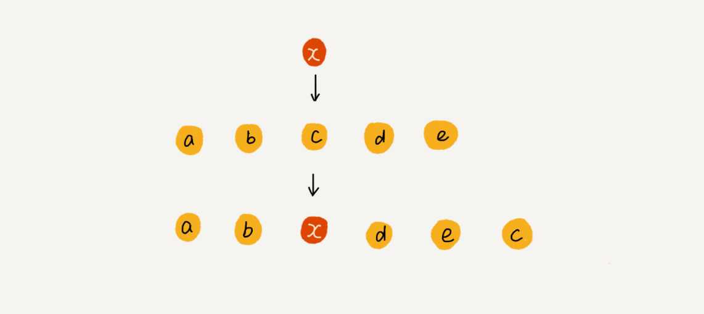

# 数组

```go
x := [5]int{1,2,3,4,5}
```

上面代码使用Go语言生成了一个长度为5的数组x.

数组(Array)是一种**线性表**数据结构,它使用一组**连续的内存空间**,用来存储一组具有**相同类型**的数据.

在大部分语言中数组都是从0开始编号的,为什么呢? 带着这个问题往下看.

## 实现随机访问

数组的定义中有下面这些关键词,线性表,连续的内存空间和相同类型的数据.

### 线性表

顾名思义,线性表就是数据排列成一条线一样的结构.数据只有向前向后两个方向,除了`数组`之外,`链表(Linked List)`,`队列(Queue)`,`栈(Stack)`等也是线性表结构.

[链表](linkedlist.md)

[栈](stach.md)


与线性表相对立的概念是**非线性表**,例如`二叉树(Binary Tree)`,`堆(Heap)`,`图(Graph)`等.


### 连续的内存空间和相同类型的数据

正式因为这两个特性(或者说限制),数组才有了随机访问的特性,但也正因为如此,对数组进行删除或者插入,为了保证数据在内存空间的连续性,需要做大量的数据搬移工作.


上图是一个长度为10的int型数组,每个数组占用4个bit,所以我们可以根据数组的头地址直接计算出任何一个成员的内存地址,也就是实现了随机访问,例如在图中我们要访问$$a[9]$$那么$$\&a[9] = \&a + 9*4 = 1000+36 = 1036$$.

> 在面试中,通常会问道数组和链表的区别:
>
> 数组擅长查找操作.
>
> 数组支持随机访问,因此在指定下标的时候,时间复杂度是O(1),但是在没有给定时间复杂度时,例如我们要进行二分查找时,时间复杂度是O(logn)
>
> 链表擅长删除或增加的操作
>
> 因此链表的删除和增加只需要在指定位置对指针内容进行修改即可,时间复杂度为O(1),同样,这些都要求已知要删除或者增加的位置.

## 低效的插入和删除

数组为了保持内存数据的连续性，会导致插入、删除这两个操作比较低效.

### 有序插入

假设数组的长度为n,如果我们要在第k个(k<n-1)位置进行插入一个数据,需要将原始数组的第k个位置之后所有的元素往后挪一个位置,并将新的数据写入,写入的时间为O(1),但是挪一个位置的时间为O(n).

当我们需要在数组结尾插入一个元素时,时间复杂度为O(1).

### 无序插入

当数组元素并没有顺序要求时,我们直接将原来第k个位置的元素值插入到数组的最后一位中,并将第k个元素修改为我们要插入的值即可,此时时间复杂度为O(1).



### 删除

与插入类似,为了保证空间的连续性,需要搬移数据

如果删除数组末尾的数据,最好的时间复杂度为O(1),删除开头的数据,时间复杂度为O(n),平均时间复杂度为O(n).

### 假删除

在某些特殊情况下,我们并不一定非得追求数组中数据的连续性(假删除).如果我们将多次删除操作集中在一起执行,效率会高很多,例如


数组 a[10]中存储了 8 个元素：a，b，c，d，e，f，g，h。现在，我们要依次删除 a，b，c 三个元素。

为了避免defgh这几个数据被搬移三次,我们可以记录已经被删除的数据,因为删除并不会要求分配新的空间,只有当我们需要插入时,发现原始内存中的连续空间不足以分配之后,进行统一删除操作,每个元素直接一次性向前挪动三次即可(区别于之前的三次,每次挪一个位置).

这也是JVM标记清除垃圾回收算法的核心思想.

## 数组访问越界问题

下面是一段C语言代码

```c

int main(int argc, char* argv[]){
    int i = 0;
    int arr[3] = {0};
    for(; i<=3; i++){
        arr[i] = 0;
        printf("hello world\n");
    }
    return 0;
}
```

在代码中,for循环执行了4次,当第四次时,i=3,而arr的长度为3,arr[3]并不存在,此时造成了数组的访问越界.

在C语言中,只要不是访问受限的内存,都是可以自由访问的(内存泄漏?)因此这段代码并不会报错,而是无限循环的输出hello world.

在其他语言中,类似于python,go,java等等会产生报错.

## 容器能否完全替代数组?

针对数组类型,很多语言都提供了容器类,例如Java中的ArrayList,C++中的vector等等.

ArrayList 最大的优势就是可以将很多数组操作的细节**封装**起来。比如前面提到的数组插入、删除数据时需要搬移其他数据等。另外，它还有一个优势，就是支持动态扩容。

Go语言中也有,例如Slice切片则是完成了Java中的ArrayList所实现的功能.

## 回答开篇问题

为什么大多数编程语言中，数组要从 0 开始编号，而不是从 1 开始呢？

下标其实就是offset,即偏移量,在数组中,数组的地址指向数组中第一个元素的地址,因此,默认第一个元素的offset=0,计算第k个元素的地址时使用下面的公式,

```go
a[k]_address = base_address + k * type_size
```

如果第一个元素的offset=1时,计算第k个元素的地址则需要使用下面公式

```go
a[k]_address = base_address + (k-1)*type_size
```

每次计算都需要多进行一次减法操作.数组作为最底层的数据结构,要尽可能减少cpu的运算,因此选择了从0开始编号.
