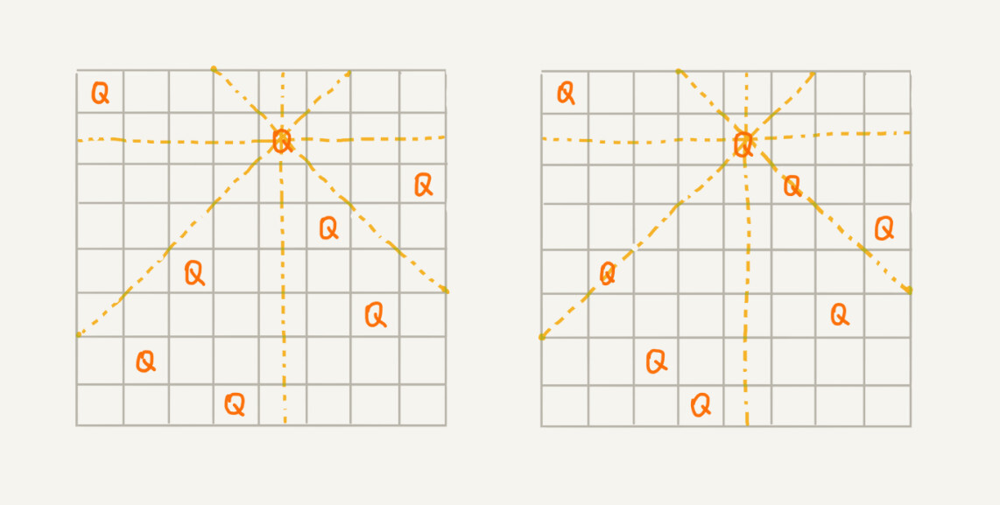

# 回溯

很多经典的数学问题都使用回溯法解决,例如八皇后,01背包问题,图的着色,旅行商问题等等.

我们可以借助前面学过的贪心算法，在每次面对岔路口的时候，都做出看起来最优的选择，期望这一组选择可以使得“最优”。但是，贪心算法并不一定能得到最优解。

回溯(backtracking)算法很多时候都应用在了"搜索"这一类问题上.

回溯的处理思想类似于枚举搜索,枚举出所有的解,找到满足期望的解.

为了有规律的枚举所有可能的解,避免重复和遗漏,我们把问题求解的过程分为多个阶段,每个阶段都会面对一个岔路口,我们先随意走上一条路,当发现这条路走不通的时候,回到上一个岔路口重新选择新的路.

## 八皇后问题

我们有一个8x8的棋盘,希望往里面放8个棋子(皇后),每个棋子所在的行,列,对角线都只有这一个棋子,下图左图是满足条件的,右图则不满足.



我们把这个问题划分成 8 个阶段，依次将 8 个棋子放到第一行、第二行、第三行……第八行。在放置的过程中，我们不停地检查当前放法，是否满足要求。如果满足，则跳到下一行继续放置棋子；如果不满足，那就再换一种放法，继续尝试。

回溯法仍然使用递归代码来实现.

```go
package backtracking

import "fmt"

var (
	cols  = make([]int, 0)
	diag1 = make([]int, 0)
	diag2 = make([]int, 0)
	/*
		对角线总共分为两种 正对角线和负对角线
		在每条正对角线上的所有元素和是相等且唯一的,即与元素(x,y)在一个正对角线上的元素包括(x+1,y-1)等等,他们的和都是x+y为固定值
		在每条正对角线上的所有元素差是相等且唯一的,即与元素(x,y)在一个负对角线上的元素包括(x+1,y+1)等等,他们的差都是x-y为固定值
		因此在对角线的slice中,每个数代表一个对角线
	*/
	n = 3
)

type board struct {
	data [][]int
}

func (b board) PrintBoard() {
	for _, rowData := range b.data {
		for _, data := range rowData {
			if data == 0 {
				fmt.Print(" *")
			} else {
				fmt.Print(" Q")
			}
		}
		fmt.Println()
	}

}

func contains(items []int, i int) bool {
	for _, item := range items {
		if item == i {
			return true
		}
	}
	return false
}
func check(row, col int, cols, diag1, diag2 []int) bool {
	if contains(cols, col) || contains(diag1, row+col) || contains(diag2, row-col) {
		// 不用判断行,因为我们是每次选择一个新行进行插入 不会有重复行出现
		return false
	}
	return true
}

func SolveNQueens(num int) (b board) {
	n = num
	b.data = make([][]int, n)

	// 初始化棋盘
	for i := range b.data {
		b.data[i] = make([]int, n)
		for j := range b.data[i] {
			b.data[i][j] = 0
		}
	}

	// 回溯求解
	backtracking(b, 0)

	return b
}

func backtracking(b board, row int) bool {
	// 回溯的进行调试
	if row == n {
		return true
	}
	rowData := b.data[row]
	for col := 0; col < len(rowData); col++ {
		if check(row, col, cols, diag1, diag2) {
			// 尝试向其中添加一个棋子  for循环只有在回溯之后才会继续进行
			b.data[row][col] = 1
			cols = append(cols, col)
			diag1 = append(diag1, row+col)
			diag2 = append(diag2, row-col)
			// 开始添加下一行 ,如果下一行返回了 直接就会return b, 如果下一行没有执行成功 则撤销刚刚的操作 继续遍历一下当前行的下一列

			if backtracking(b, row+1) {
				return true
			}
			b.data[row][col] = 0
			cols = cols[:len(cols)-1]
			diag1 = diag1[:len(diag1)-1]
			diag2 = diag2[:len(diag2)-1]

		}
	}
	return false
}

```

## 0-1背包问题

我们有一个背包，背包总的承载重量是 Wkg。现在我们有 n 个物品，每个物品的重量不等，并且**不可分割**。我们现在期望选择几件物品，装载到背包中。在不超过背包所能装载重量的前提下，如何让背包中物品的总重量最大？

```go
func backtracking(当前背包重量){
  if (装满||没装满但考察完所有的物品){
    maxRes = max(maxRex,当前背包重量)
    break // 终止条件
  }
  backtracking(当前背包重量不变)//不装物品
  if 装上这个物品<=重量{
    // 剪枝 因为装上之后也会超出 直接剪掉 所以只有满足加上当前物品重量仍然小于等于最大承重时继续加入物品
    backtracking(当前背包重量+当前物品重量)//装当前物品
  }

}
```

