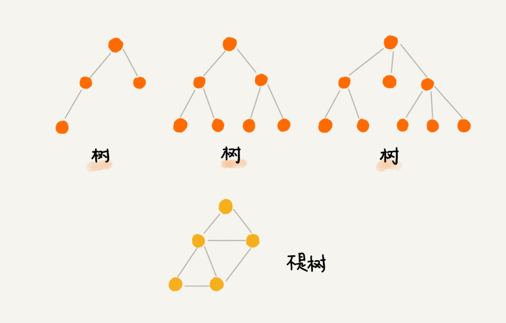
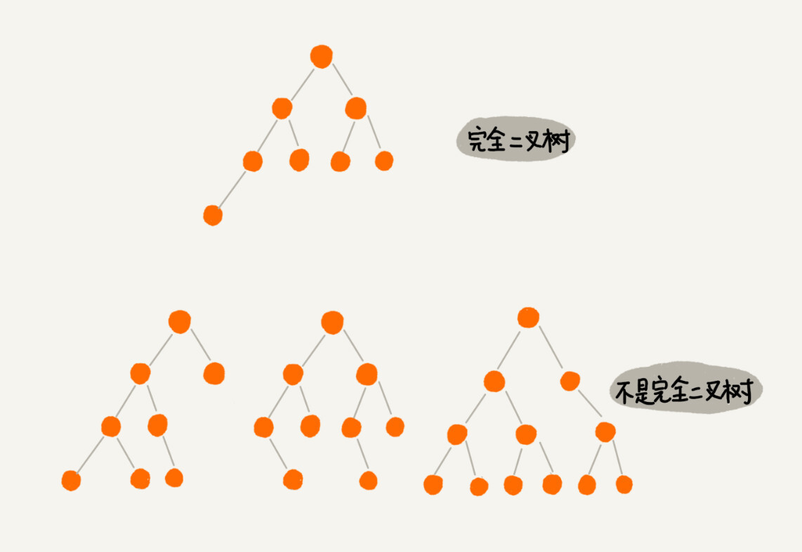
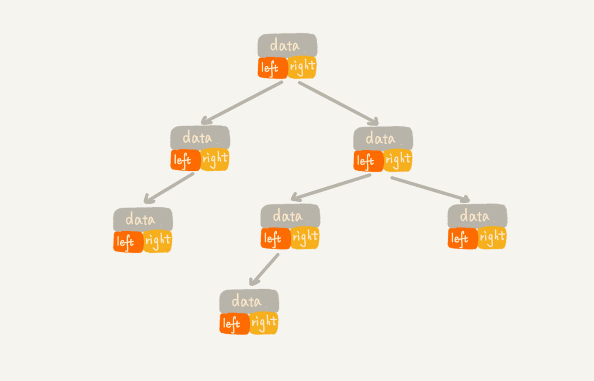
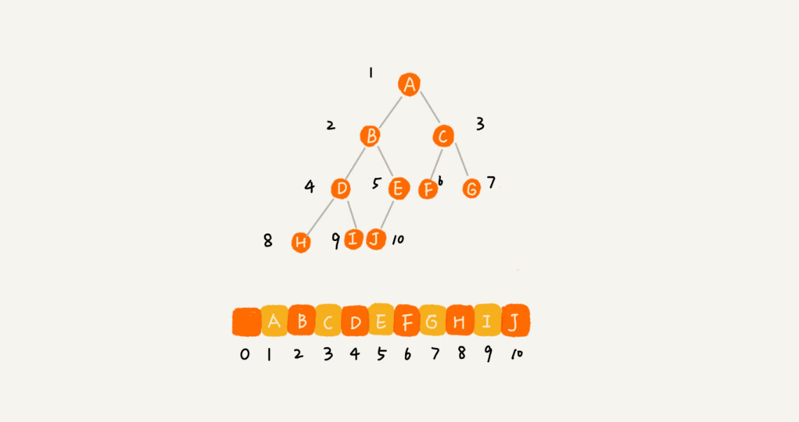

# 二叉树

## 树的概念



树种的每个元素叫做"节点",同级之间的节点不相连,用来连接相邻节点之间的关系，我们叫做“父子关系”。父节点是同一个节点的节点之间互称为兄弟节点。

节点的高度=节点到叶子结点的最长路径(边数)

节点的深度=根节点到这个节点所经历的边的个数

节点的层数=节点的深度+1

树的高度=根节点的高度


## 二叉树的概念

二叉树，顾名思义，每个节点最多有两个“叉”，也就是两个子节点，分别是左子节点和右子节点。


上图中2号二叉树称为**满二叉树**,叶子节点都在最底下两层，最后一层的叶子节点都靠左排列，并且除了最后一层，其他层的节点个数都要达到最大，这种二叉树叫做完全二叉树。 满二叉树是特殊的完全二叉树.



二叉树是一种逻辑数据结构,在代码中,一般使用两种方法来表示二叉树,一种是**基于指针或者引用的二叉链式存储法**,一种是**基于数组的顺序存储法**.





所以，如果某棵二叉树是一棵完全二叉树，那用数组存储无疑是最节省内存的一种方式。因为数组的存储方式并不需要像链式存储法那样，要存储额外的左右子节点的指针。

## 二叉树的遍历

**前序遍历**是指，对于树中的任意节点来说，先打印这个节点，然后再打印它的左子树，最后打印它的右子树。

中序遍历是指，对于树中的任意节点来说，先打印它的左子树，然后再打印它本身，最后打印它的右子树。

**后序遍历**是指，对于树中的任意节点来说，先打印它的左子树，然后再打印它的右子树，最后打印这个节点本身。

**层次遍历**是指按照层输出,一般使用队列的方式进行遍历,输出一个节点之前,使其子节点入队.


递归遍历代码

```java

void preOrder(Node* root) {
  if (root == null) return;
  print root // 此处为伪代码，表示打印root节点
  preOrder(root->left);
  preOrder(root->right);
}

void inOrder(Node* root) {
  if (root == null) return;
  inOrder(root->left);
  print root // 此处为伪代码，表示打印root节点
  inOrder(root->right);
}

void postOrder(Node* root) {
  if (root == null) return;
  postOrder(root->left);
  postOrder(root->right);
  print root // 此处为伪代码，表示打印root节点
}
```

二叉树遍历的时间复杂度是 **O(n)。**

## 二叉查找树

二叉查找树（Binary Search Tree）是为了实现快速查找而生的,它不仅仅支持快速查找一个数据，还支持快速插入、删除一个数据。

要求**树中任意的一个节点,左子树<该节点<右子树**


### 查找操作

在查找树有序的要求下,我们先取根节点，如果它等于我们要查找的数据，那就返回。如果要查找的数据比根节点的值小，那就在左子树中**递归**查找；如果要查找的数据比根节点的值大，那就在右子树中**递归**查找。

查找树的思想类似于二分查找,不过二叉查找树是已经实现了二分的特殊数据结构.

### 插入操作

新插入的数据一般都是在**叶子节点**上，所以我们只需要从根节点开始，依次比较要插入的数据和节点的大小关系。

如果要插入的数据比节点的数据大，并且节点的右子树为空，就将新数据直接插到右子节点的位置；如果不为空，就再递归遍历右子树，查找插入位置。

同理，如果要插入的数据比节点数值小，并且节点的左子树为空，就将新数据插入到左子节点的位置；如果不为空，就再递归遍历左子树，查找插入位置。

### 删除操作

二叉查找树的删除操作较为复杂,主要分为三种情况:

一,如果要删除的节点没有子节点:直接将其父节点指向该节点的指针置空即可.

二,如果要删除的节点只有一个子节点:将要被删除的节点的父节点的指针指向要被删除的节点的子节点.

三,如果要删除的节点有两个子节点:找到该节点的最小子节点,将要被删除的节点的值更新为最小子节点的值,并置空指向该最小子节点的指针.


实际上，关于二叉查找树的删除操作，还有个非常简单、取巧的方法，就是单纯将要删除的节点标记为“已删除”，但是并不真正从树中将这个节点去掉。这样原本删除的节点还需要存储在内存中，比较浪费内存空间，但是删除操作就变得简单了很多。而且，这种处理方法也并没有增加插入、查找操作代码实现的难度。

### 支持重复数据的二叉查找树

针对数据重复的情况下的二叉查找树,一般使用两种方法进行插入

1.将每个节点转换为链表进行存储

2.新的元素放到相同值的节点的右子树中的叶子节点中.


当要查找数据的时候，遇到值相同的节点，我们并不停止查找操作，而是继续在右子树中查找，直到遇到叶子节点才停止。这样就可以把键值等于要查找值的所有节点都找出来。

### 时间复杂度

平衡二叉查找树的高度接近 logn，所以插入、删除、查找操作的时间复杂度也比较稳定，是 O(logn)。

## 散列表与二叉树的对比

### 时间复杂度

散列表的插入,查找,删除操作的时间复杂度为O(1)

二叉查找树在平衡的情况下 时间复杂度是O(logn)

### 有序数据支持

散列表的数据是无序存储的,如果需要输出有序的数据,需要进行排序,

二叉查找树只需要中序遍历,即可在O(n)时间复杂度内输出有序的数据序列

### 稳定性

散列表可能存在散列冲突的问题,而二叉树十分稳定

 ## 便利性

散列表的构造要求考虑到散列函数的设计,冲突解决办法,扩容,缩容等问题

二叉查找树仅仅需要考虑平衡性这一个问题

各有优劣 根据实际情况使用.