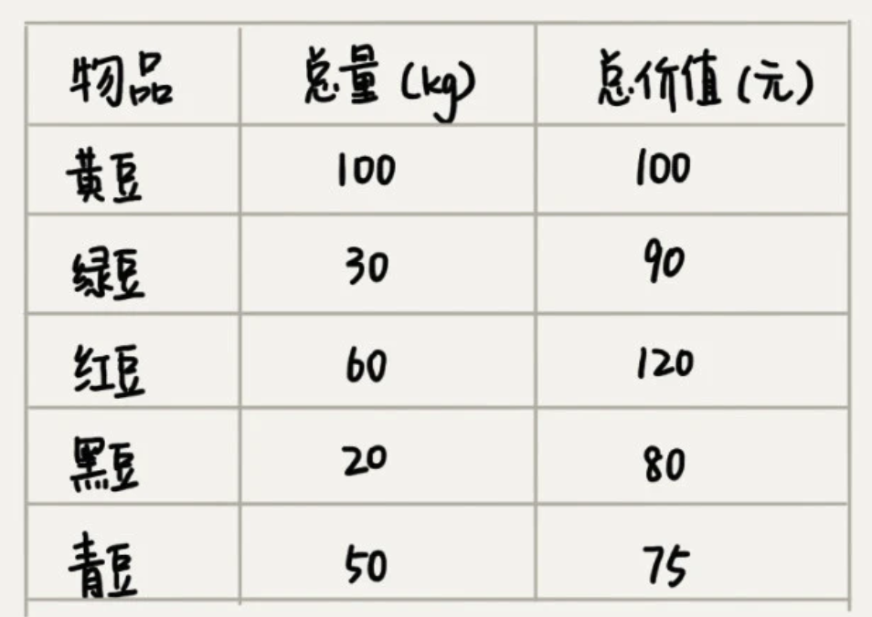
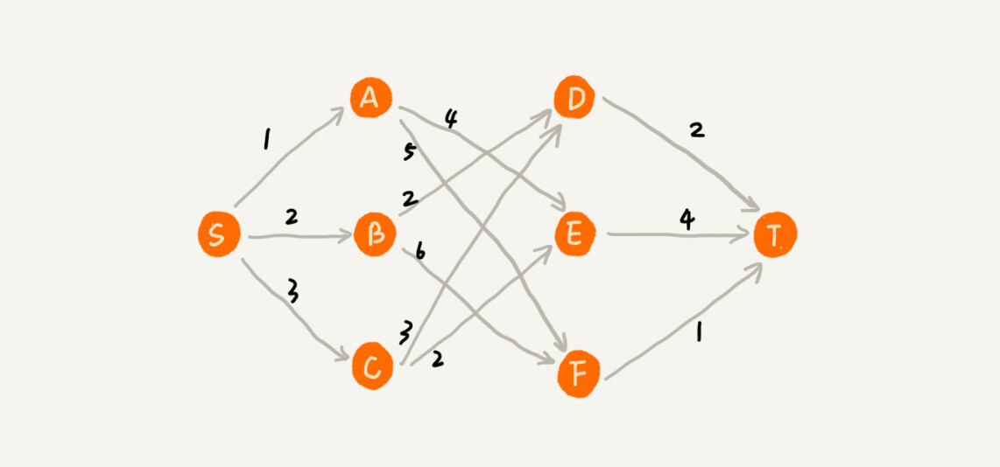

# 贪心算法

贪心算法(Greedy Algorithm)有需要经典的应用,例如哈夫曼编码,Prim和Kruskal最小生成树算法以及Dijkstra单源最短路径算法.

## 如何理解贪心算法

假设有一个可以容纳100kg物品的背包,有下面五种豆子,如何装能让背包中所有的总价值最大?



根据性价比进行排序,依次是：黑豆、绿豆、红豆、青豆、黄豆，所以，我们可以往背包里装 20kg 黑豆、30kg 绿豆、50kg 红豆。

总结贪心算法的步骤:

一,当我们看到这类问题的时候,首先需要联想到贪心算法:针对一组数据,我们**定义了限制值和期望值**,希望从中选取几个数据,在满足限制值的条件下,期望值最大.在刚才的例子中,限制值便是100kg,期望值是总价值.

二,尝试这个问题是否可以使用贪心算法解决:每次选择当前时,对限制值同等贡献量的情况下，对期望值贡献最大的数据。

三,我们举几个例子看下贪心算法产生的结果是否**是最优**的。大部分情况下，举几个例子验证一下就可以了。严格地证明贪心算法的正确性，是非常复杂的，需要涉及比较多的数学推理。而且，从实践的角度来说，大部分能用贪心算法解决的问题，贪心算法的正确性都是显而易见的，也不需要严格的数学推导证明。

实际上，用贪心算法解决问题的思路，**并不总能给出最优解**。例如下面的例子:



如果使用GA,则会找到S->A->E->T 这个路径长为9的路径,但是很明显这个并非是最优解,根本原因在于**前面的选择会影响到后续的选择**,即**局部最优不代表着全局最优**

## 贪心算法实战分析

### 分糖果

共m个糖果,n个孩子,要将糖果分给孩子,但是m<n,所以只能分配给一部分孩子.每个糖果的大小不等，这 m 个糖果的大小分别是 s1，s2，s3，……，sm。除此之外，每个孩子对糖果大小的需求也是不一样的，只有糖果的大小大于等于孩子的对糖果大小的需求的时候，孩子才得到满足。假设这 n 个孩子对糖果大小的需求分别是 g1，g2，g3，……，gn。如何分配糖果，能尽可能**满足最多数量**的孩子？

对于一个孩子来说，如果小的糖果可以满足，我们就没必要用更大的糖果，这样更大的就可以留给其他对糖果大小需求更大的孩子。另一方面，对糖果大小需求小的孩子更容易被满足，所以，我们可以从需求小的孩子开始分配糖果。因为满足一个需求大的孩子跟满足一个需求小的孩子，对我们期望值的贡献是一样的。

每次从剩下的孩子中,找到对糖果大小需求最小的,然后发给他剩下的糖果中满足他的最小的糖果.

### 钱币找零

假设我们有 1 元、2 元、5 元、10 元、20 元、50 元、100 元这些面额的纸币，它们的张数分别是 c1、c2、c5、c10、c20、c50、c100。

我们现在要用这些钱来支付 K 元，最少要用多少张纸币呢？

在生活中，我们肯定是先用面值最大的来支付，如果不够，就继续用更小一点面值的，以此类推，最后剩下的用 1 元来补齐。在贡献相同期望值（纸币数目）的情况下，我们希望多贡献点金额，这样就可以让纸币数更少，这就是一种贪心算法的解决思路。直觉告诉我们，这种处理方法就是最好的。

### 区间覆盖

假设我们有 n 个区间，区间的起始端点和结束端点分别是[l1, r1]，[l2, r2]，[l3, r3]，……，[ln, rn]。我们从这 n 个区间中选出一部分区间，这部分区间满足两两不相交（端点相交的情况不算相交），最多能选出多少个区间呢？

我们按照起始端点从小到大的顺序对这 n 个区间排序。我们每次选择的时候，**左端点跟前面的已经覆盖的区间不重合的，右端点又尽量小的，**这样可以让剩下的未覆盖区间尽可能的大，就可以放置更多的区间。这实际上就是一种贪心的选择方法。

### 哈夫曼编码

哈夫曼=霍夫曼=Huffman

假设我有一个包含 1000 个字符的文件，每个字符占 1 个 byte（1byte=8bits），存储这 1000 个字符就一共需要 8000bits，那有没有更加节省空间的存储方式呢？

假设我们通过统计分析发现，这 1000 个字符中只包含 6 种不同字符，假设它们分别是 a、b、c、d、e、f。而 3 个二进制位（bit）就可以表示 8 个不同的字符，所以，为了尽量减少存储空间，每个字符我们用 3 个二进制位来表示。那存储这 1000 个字符只需要 3000bits 就可以了，比原来的存储方式节省了很多空间。不过，还有没有更加节省空间的存储方式呢？

> a(000)、b(001)、c(010)、d(011)、e(100)、f(101)

霍夫曼编码是一种十分有效的编码方法，广泛用于数据压缩中，其压缩率通常在 20%～90% 之间。

霍夫曼编码不仅会考察文本中有多少个不同字符，还会考察每个字符出现的频率，根据频率的不同，选择不同长度的编码。霍夫曼编码试图用这种不等长的编码方法，来进一步增加压缩的效率。如何给不同频率的字符选择不同长度的编码呢？根据贪心的思想，我们可以把出现频率比较多的字符，用稍微短一些的编码；出现频率比较少的字符，用稍微长一些的编码。

对于等长的编码来说，我们解压缩起来很简单。比如刚才那个例子中，我们用 3 个 bit 表示一个字符。在解压缩的时候，我们每次从文本中读取 3 位二进制码，然后翻译成对应的字符。

但是，**霍夫曼编码是不等长的**，每次应该读取 1 位还是 2 位、3 位等等来解压缩呢？这个问题就导致霍夫曼编码解压缩起来比较复杂。为了避免解压缩过程中的歧义，霍夫曼编码要求各个字符的编码之间，不会出现某个编码是另一个编码前缀的情况。例如0是a,不会出现01是b的现象.

假设这 6 个字符出现的频率从高到低依次是 a、b、c、d、e、f。我们把它们编码下面这个样子，任何一个字符的编码都不是另一个的前缀，在解压缩的时候，我们每次会读取尽可能长的可解压的二进制串，所以在解压缩的时候也不会歧义。

经过这种编码压缩之后，这 1000 个字符只需要 2100bits 就可以了。

8000>3000>2100

huffman二叉树


## LeetCode真题

[455. 分发饼干 - 力扣（LeetCode）](https://leetcode.cn/problems/assign-cookies/)

此题类似于上述的分糖果问题

假设你是一位很棒的家长，想要给你的孩子们一些小饼干。但是，每个孩子最多只能给一块饼干。

对每个孩子 i，都有一个胃口值 g[i]，这是能让孩子们满足胃口的饼干的最小尺寸；并且每块饼干 j，都有一个尺寸 s[j] 。如果 s[j] >= g[i]，我们可以将这个饼干 j 分配给孩子 i ，这个孩子会得到满足。你的目标是尽可能满足越多数量的孩子，并输出这个最大数值。

```go
func findContentChildren(g []int, s []int) int {
	// 经典贪心算法
	// sort
	sort.Ints(g)
	sort.Ints(s)

	res := 0
	cookieCount := len(s) // 饼干的总数
	j := 0
	for _, demand := range g {
		for j < len(s) {
			sups := s[j]
			if sups >= demand {
				// 满足条件则分配一个给他
				res++         // 结果+1
				j++           // 下标+1
				cookieCount-- //剩余饼干数-1
				break         //开始判断下一个人
			}
			if j == len(s)-1 {
				// 此时这个人给到最后也不满足条件 后面的孩子要求更高 都没有份了 直接返回即可
				return res
			}
			j++
		}
	}
	return res
}
```

