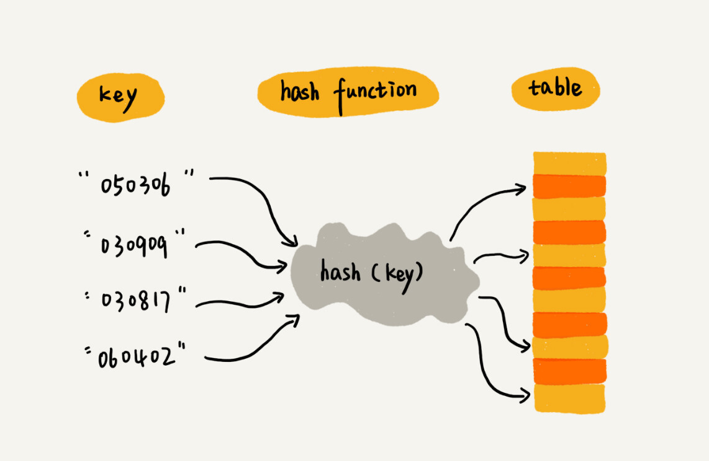
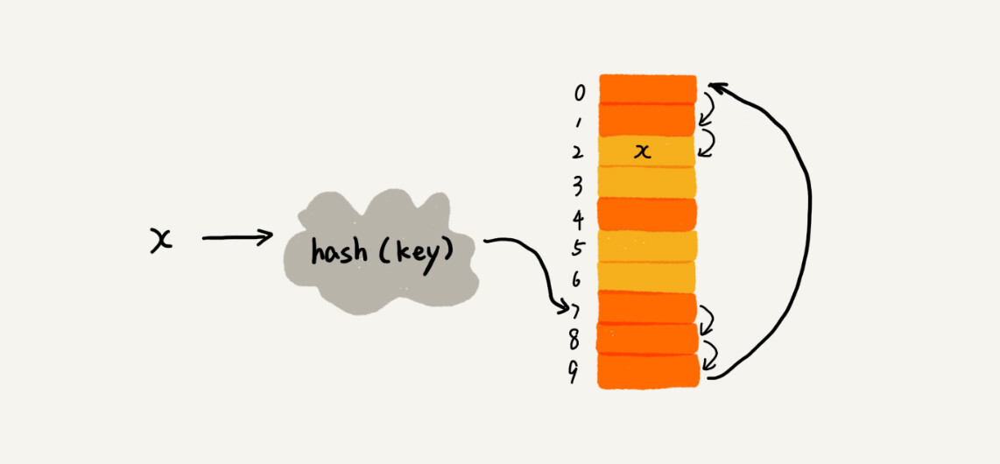
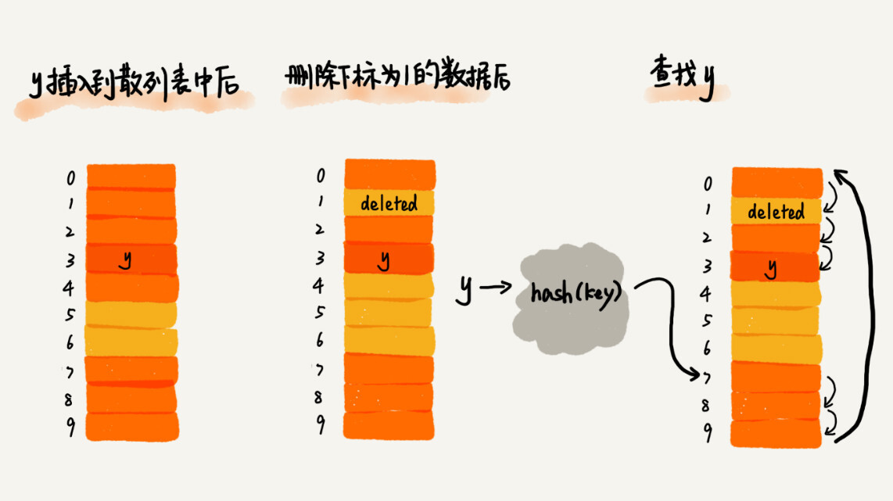

# 散列表

**散列表**利用数组支持下表随机访问数据的特性,所以说散列表是数组的一种扩展.

假如有个一个比赛,所有参赛选手的信息都存放在一个数组中,但是现实中选手都是通过编号来记录的,参赛选手的编号我们叫做键（key）或者关键字。把Key转化为数组下标的映射方法就叫作散列函数（或“Hash 函数”“哈希函数”），而散列函数计算得到的值就叫作散列值（或“Hash 值”“哈希值”）。散列值即数组下标,通过下标即可在O(1)的时间内获得数据.



## 散列函数 HashFunction

在上面例子中,假如table存储了一个班级内的所有信息,那么为了根据key获取这个运动员的信息,hashFunction可以直接写成获取后key的后两位-1,即table的下标.

### 散列函数的基本要求

1. HashFunction计算得到的值都是非负整数
2. 如果key1==key2,那么hash(key1)==hash(key2)
3. 如果key1!=key2,那么hash(key1)!=hash(key2)

但是在真实的情况下，要想找到一个不同的 key 对应的散列值都不一样的散列函数，几乎是不可能的。即便像业界著名的MD5、SHA、CRC等哈希算法，也无法完全避免这种散列冲突。而且，因为数组的存储空间有限，也会加大散列冲突的概率。

### 散列冲突

#### 开放寻址法 Open Addressing

开放寻址法的核心思想是,如果出现了散列冲突,就重新探测一个空闲的位置将其插入.重新探测的方法有很多,**线性探测(Linear Probing)**.

插入数据

当我们往散列表中插入数据时，如果某个数据经过散列函数散列之后，存储位置已经被占用了，我们就从当前位置开始，依次往后查找，看是否有空闲位置，直到找到为止。

查找数据

在散列表中查找元素的过程类似插入过程。我们通过散列函数求出要查找元素的键值对应的散列值，然后比较数组中下标为散列值的元素和要查找的元素。如果相等，则说明就是我们要找的元素,查找失败；否则就顺序往后依次查找。如果遍历到数组中的空闲位置，还没有找到，就说明要查找的元素并没有在散列表中,查找成功。

删除数据

散列表跟数组一样，不仅支持插入、查找操作，还支持删除操作。对于使用线性探测法解决冲突的散列表，删除操作稍微有些特别。我们不能单纯地把要删除的元素设置为空。如果这个空闲位置是我们后来删除的，就会导致原来的查找算法失效。本来存在的数据，会被认定为不存在。这个问题如何解决呢？我们可以将删除的元素，特殊标记为 deleted。当线性探测查找的时候，遇到标记为 deleted 的空间，并不是停下来，而是继续往下探测。



在开放寻址法中,除了线性探测,还有**二次探测(Quadratic probing)**和**双重散列(Double hashing)**等方法

二次探测即将线性探测的hash(key)+0,hash(key)+1,hash(key)+2的方法修改为hash(key)+0,hash(key)+1,hash(key)+4,hash(key)+9...

双重散列即使用多个散列函数,当检测到冲突时,继续使用下一个hashNext(key).


#### 链表法

链表法是一种更常用的散列冲突解决办法.每个bucket或者slot会对应一条链表.


当插入的时候，我们只需要通过散列函数计算出对应的散列槽位，将其插入到对应链表中即可，所以插入的时间复杂度是 O(1)。

当查找、删除一个元素时，我们同样通过散列函数计算出对应的槽，然后遍历链表查找或者删除。实际上，这两个操作的时间复杂度跟链表的长度 k 成正比，也就是 O(k)。对于散列比较均匀的散列函数来说，理论上讲，k=n/m，其中 n 表示散列中数据的个数，m 表示散列表中“槽”的个数。

## 装载因子

```text
散列表的装载因子 = 表中元素个数/表长
```

装载因子越大,说明空闲位置越少,冲突发生的可能性越多,性能会下降.

## 散列表碰撞攻击

在极端情况下，有些恶意的攻击者，还有可能通过精心构造的数据，使得所有的数据经过散列函数之后，都散列到同一个槽里。如果我们使用的是基于链表的冲突解决方法，那这个时候，散列表就会退化为链表，查询的时间复杂度就从 O(1) 急剧退化为 O(n)。

如果散列表中有 10 万个数据，退化后的散列表查询的效率就下降了 10 万倍。更直接点说，如果之前运行 100 次查询只需要 0.1 秒，那现在就需要 1 万秒。这样就有可能因为查询操作消耗大量 CPU 或者线程资源，导致系统无法响应其他请求，从而达到拒绝服务攻击（DoS,Denial of Service）的目的。这也就是散列表碰撞攻击的基本原理。

## 哈希算法

将**任意**长度的二进制值串映射为固定长度的二进制值串，这个映射的规则就是**哈希算法**，而通过原始数据映射之后得到的二进制值串就是**哈希值**。

哈希算法的要求:

1. 哈希值不能反向推导出原始数据(非对称)
2. 输入数据敏感型,输入数据哪怕有单bit的差距,得到的值也完全不同
3. 哈希冲突的概率极低
4. 效率尽可能高

常见的哈希算法包括了MD5,SHA-1,SHA-128,DES,AES算法等等

### MD5算法

MD5的哈希值是128位的二进制数,4位二进制可以转成一个十六进制 所以可以将MD5的结果转成32位的十六进制

```text

MD5("今天我来讲哈希算法") = bb4767201ad42c74e650c1b6c03d78fa
MD5("jiajia") = cd611a31ea969b908932d44d126d195b
MD5("我今天讲哈希算法！") = 425f0d5a917188d2c3c3dc85b5e4f2cb
MD5("我今天讲哈希算法") = a1fb91ac128e6aa37fe42c663971ac3d
```

即便哈希算法存在散列冲突的情况，但是因为哈希值的范围很大，冲突的概率极低，所以相对来说还是很难破解的。

像 MD5，有 2^128 个不同的哈希值，这个数据已经是一个天文数字了，所以散列冲突的概率要小于 1/2^128。如果我们拿到一个 MD5 哈希值，希望通过毫无规律的穷举的方法，找到跟这个 MD5 值相同的另一个数据，那耗费的时间应该是个天文数字。所以，即便哈希算法存在冲突，但是在有限的时间和资源下，哈希算法还是很难被破解的。

哈希算法主要应用在了

1. 安全加密
2. 文件的唯一标识
3. 数据校验
4. 散列函数
5. 负载均衡
6. 数据分片
7. 分布式存储

