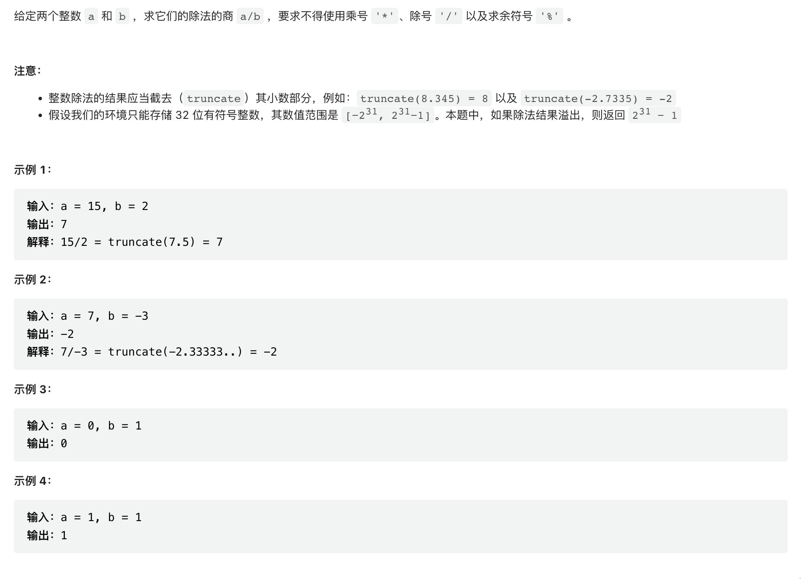
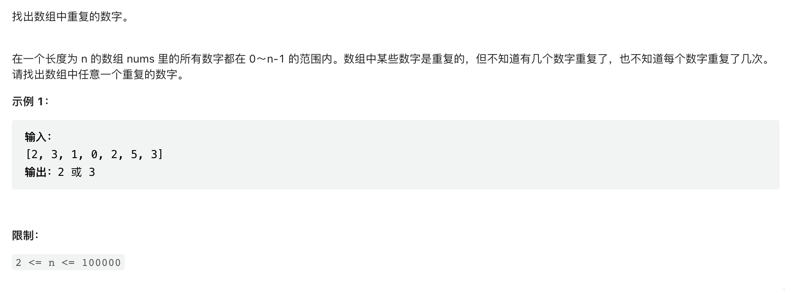

# 剑指Offer

## JZ1 整数除法

[JZ1 整数除法](https://leetcode.cn/problems/xoh6Oh/)

## JZ3 数组中重复的数字

[题目链接](https://www.nowcoder.com/practice/6fe361ede7e54db1b84adc81d09d8524?tpId=265&tags=&title=&difficulty=0&judgeStatus=0&rp=1&sourceUrl=%2Fexam%2Foj%2Fta%3FtpId%3D13)  

考察数组的存取速度快这一特性,使用hash法可以很快地完成任务. 

如果要求空间为O(1),则需要通过二分法进行查找,因为在leetcode中,长度为n,而所有的数字都在0~n-1这个范围内,则一定有重复的出现,每次通过查找两个部分,统计出现的次数.

## 只出现一次的数字

[题目链接](https://leetcode.cn/problems/WGki4K/)

[代码](JZ004/one/main.go)

## 前 n 个数字二进制中 1 的个数

给定一个非负整数 n ，请计算 0 到 n 之间的每个数字的二进制表示中 1 的个数，并输出一个数组。

[题目链接](https://leetcode.cn/problems/w3tCBm/)

[代码](JZ003/one/main.go)

## 排序数组中两个数字之和

[题目链接](https://leetcode.cn/problems/kLl5u1/)

[代码](JZ006/one/main.go)

考察

双指针 数组

## 数组中和为 0 的三个数

[题目链接](https://leetcode.cn/problems/1fGaJU/)

[代码](JZ007/one/main.go)

考察

细节 双指针 排序 数组

## 和大于等于target的最短子数组
!!!没有思路

[题目链接](https://leetcode.cn/problems/2VG8Kg/)

[代码](JZ008/one/main.go)

考察

数组  滑动窗口

[二分法查找](JZ3/binaryseach)

[JZ4 二维数组中的查找](https://www.nowcoder.com/practice/abc3fe2ce8e146608e868a70efebf62e?tpId=265&tags=&title=&difficulty=0&judgeStatus=0&rp=1&sourceUrl=%2Fexam%2Foj%2Fta%3FtpId%3D13)  

[JZ5 替换空格](https://www.nowcoder.com/practice/0e26e5551f2b489b9f58bc83aa4b6c68?tpId=265&tags=&title=&difficulty=0&judgeStatus=0&rp=1&sourceUrl=%2Fexam%2Foj%2Fta%3FtpId%3D13)  

[JZ6 从尾到头打印链表](https://www.nowcoder.com/practice/d0267f7f55b3412ba93bd35cfa8e8035?tpId=265&tags=&title=&difficulty=0&judgeStatus=0&rp=1&sourceUrl=%2Fexam%2Foj%2Fta%3FtpId%3D13)  

[JZ7 重建二叉树](https://www.nowcoder.com/practice/8a19cbe657394eeaac2f6ea9b0f6fcf6?tpId=265&tags=&title=&difficulty=0&judgeStatus=0&rp=1&sourceUrl=%2Fexam%2Foj%2Fta%3FtpId%3D13)  
