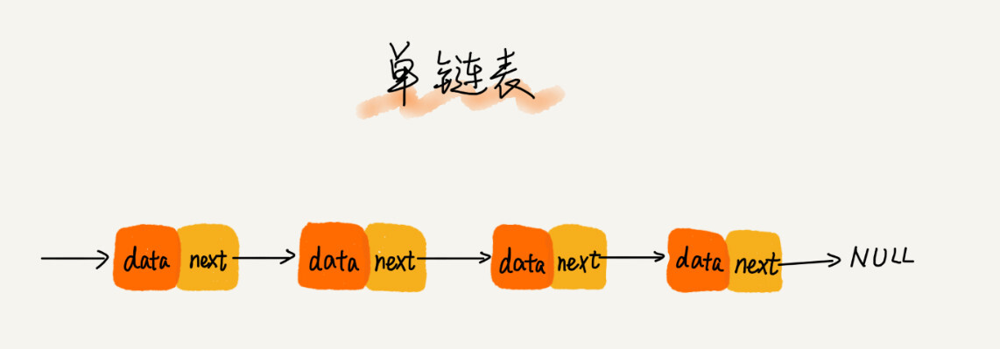
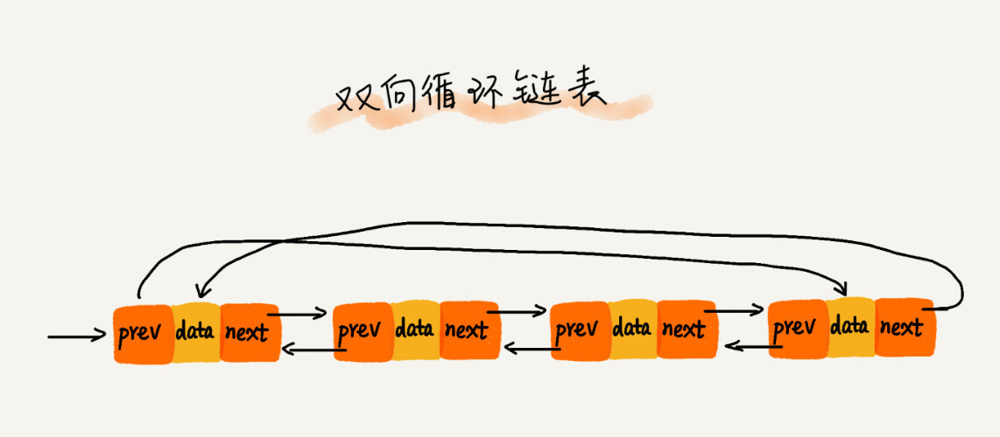
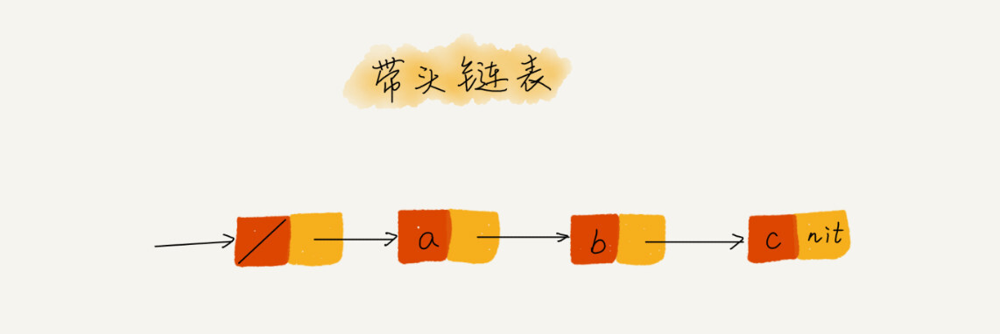

# 链表

链表(Linked List)是一种物理存储结构上非连续,非顺序的存储结构,数据的逻辑顺序是是通过链表中的指针链接次序所实现的,由一系列节点组成.

> 结点=节点


数组需要一块连续的物理内存进行数据存储,而链表不需要,通过指针将内存块串联起来.

## 常见的链表

链表结构五花八门,最常见的链表结构包括[单链表](#单链表),[双向链表](#双向链表)和[循环链表](#循环链表).

### 单链表

单链表是最简单最常用的链表.



单链表中的每个节点(Node)除了要存储数据之外还需要存储一个指针,这个指针指向下一个节点,记录着下一个节点的地址,我们称其为`后继指针(next)`.最后一个后继指针指向NULL(Go语言中的nil).

在单链表中有两个特殊的Node,分别是`头节点(Head Node)`和`尾节点(Tail Node)`.

> 头节点用来存储链表的基地址,通过从基地址开始遍历可以得到整条链表.
>
> 尾节点是链表的最后一个节点,当遍历到尾节点时,证明对当前的链表遍历已经结束.

与数组相同,链表也支持查找,插入和删除操作.

在链表中插入或者删除一个数据我们只需要修改Node的指针内容即可.时间复杂度为O(1).


有利有弊,链表想要访问第k个元素,需要从头进行遍历,寻址k+1次即可找到第k个元素.平均时间复杂度为O(n).

### 循环链表

循环链表是一种特殊的单链表,特殊在tail node,在循环链表中,尾节点的指针并非指向null,而是指向了head node,如下图表示


### 双向链表

单链表只有一个方向,而双向链表则支持两个方向,每个节点包括一个`前驱指针prev`,`后继指针next`和一个`数据data`.


在实际的软件开发中,从链表中删除一个数据无非两种情况:

* 删除链表中data=x的node
* 删除给定指针指向的node

对于第一种情况,无论是单链表还是双向链表,为了找到指定节点,都需要从头开始遍历

对于第二种情况,我们已经找到了要删除的节点,假设我们需要使用单链表,我们需要将要被删除的节点的前置节点的指针指向被删除的下一个节点,**但是我们没有办法得到前置节点的地址**,只能重新开始遍历,时间复杂度为O(n).

此时双向链表直接定位到要删除的节点,根据前驱指针得到前置节点,完成后续操作即可,时间复杂度O(1).

同理 当我们需要在指定元素前插入某个节点,双向链表的时间复杂度仍为O(1).

双向链表是经典的**空间换时间**的思想体现.

### 双向循环链表



## 链表与数组性能对比


## 常见代码错误

### 指针丢失和内存泄漏

`内存泄漏（Memory Leak）`是指程序中已动态分配的堆内存由于某种原因程序未释放或无法释放，造成系统内存的浪费，导致程序运行速度减慢甚至系统崩溃等严重后果.

简单来说，就是你向系统申请分配内存进行使用，可是使用完了以后却不归还，结果你申请到的那块内存你自己也不能再访问，而系统也不能再次将它分配给需要的程序.


如图所示,想要在节点a和节点b之间插入一个节点x,假设当前指针p指向了a.

正常情况下我们的顺序如下

* x的后继指针指向b 即x->next = p->next
* p的后继指针指向x 即p->next = x

如果我们使用下面的代码进行指针分配

```c
p->next = x
x->next = p->next
```

p->next 指针在完成第一步操作之后，已经不再指向结点 b 了，而是指向结点 x。第 2 行代码相当于将 x 赋值给 x->next，自己指向自己。因此，整个链表也就断成了两半，从结点 b 往后的所有结点都无法访问到了。

对于有些语言来说，比如 C 语言，内存管理是由程序员负责的，如果没有手动释放结点对应的内存空间，就会产生内存泄露。所以，我们插入结点时，一定要注意操作的顺序，要先将结点 x 的 next 指针指向结点 b，再把结点 a 的 next 指针指向结点 x，这样才不会丢失指针，导致内存泄漏。

同理，删除链表结点时，需要**手动释放内存空间**，否则，也会出现内存泄漏的问题。当然，对于像 Java 这种虚拟机自动管理内存的编程语言来说，就不需要考虑这么多了。

### 哨兵节点

在一个单链表中,如果没有哨兵节点,对头节点的操作往往需要单独处理

```c

if (head == null) {
  head = new_node; //头结点处插入新的节点
}

if (head->next == null) {
   head = null; // 删除头结点
}
```

在加入哨兵节点之后,链表就如下所示:



不需要对头节点进行单独处理,因为头结点是个哨兵.

实际上，这种利用哨兵简化编程难度的技巧，在很多代码实现中都有用到，比如插入排序、归并排序、动态规划等。

### 留意边界条件

常见的链表代码边界条件如下:

* 链表为空
* 链表只有一个节点
* 链表只有两个节点
* 为头结点和尾部节点的独立处理

### 画图帮助


### 多练习

* 单链表反转
* 链表中 环的检测
* 两个有序的链表合并
* 删除链表倒数第 n 个结点
* 求链表的中间结点
