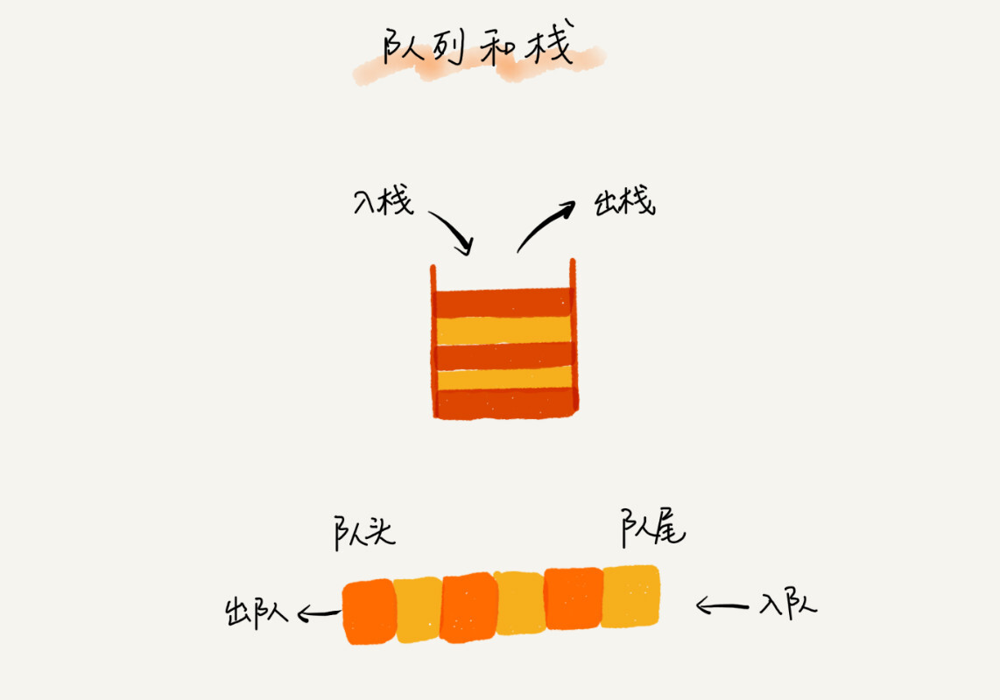
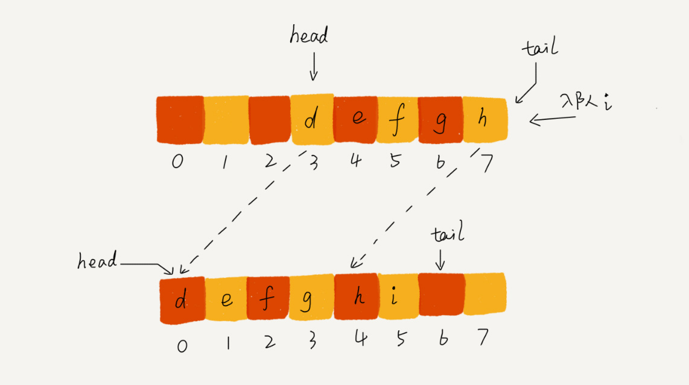

# 队列

`队列(Queue)`的概念较为简单,不做介绍,其特性为**先进先出(First In First Out,FIFO)**.同栈一样,都是操作受限的线性表.

队列的基本操作也是两个,`入队(enqueue)`和`出队(dequeue)`.

> 入队即将元素放到队列的尾部.
>
> 出队即将队列的头部元素取出并返回.



队列的应用非常广泛，特别是一些具有某些额外特性的队列，比如`循环队列`、`阻塞队列`、`并发队列`。它们在很多偏底层系统、框架、中间件的开发中，起着关键性的作用。比如高性能队列 Disruptor、Linux 环形缓存，都用到了循环并发队列；Java concurrent 并发包利用 ArrayBlockingQueue 来实现公平锁等。

## 顺序队列(Sequential Queue)

与栈相同,队列都是抽象的数据结构,可以使用数组(顺序队列)实现,也可以使用链表(链式队列)来实现.



### java

```java

// 用数组实现的队列
public class ArrayQueue {
  // 数组：items，数组大小：n
  private String[] items;
  private int n = 0;
  // head表示队头下标，tail表示队尾下标
  private int head = 0;
  private int tail = 0;

  // 申请一个大小为capacity的数组
  public ArrayQueue(int capacity) {
    items = new String[capacity];
    n = capacity;
  }

  // 入队
  public boolean enqueue(String item) {
    // 如果tail == n 表示队列已经满了
    if (tail == n) return false;
    items[tail] = item;
    ++tail;
    return true;
  }

  // 出队
  public String dequeue() {
    // 如果head == tail 表示队列为空
    if (head == tail) return null;
    // 为了让其他语言的同学看的更加明确，把--操作放到单独一行来写了
    String ret = items[head];
    ++head;
    return ret;
  }
}
```

### go

```go
package queue

import (
 "errors"
 "fmt"
)

type intQueue struct {
 data []int64
 Len  int
 Head int // Head 指向队头的第一个数据
 Tail int // Tail 指向队尾最后一个空节点
}

// Dequeue 出队列
func (queue *intQueue) Dequeue() (int64, error) {
 if queue.Len == 0 {
  return -1, errors.New("队列长度为0,无法执行出列方法")
 }
 tmp := queue.data[queue.Head]
 queue.Len -= 1
 queue.Head += 1

 // 当有效元素过少时,重新分配
 if queue.Len <= len(queue.data)/2 {
  tmpQueueData := queue.data[queue.Head:queue.Tail]
  queue.data = tmpQueueData
  queue.Head = 0
  queue.Tail = queue.Len
 }

 fmt.Printf("当前队列剩余长度%d,容量%d\n", queue.Len, cap(queue.data))
 return tmp, nil
}

func (queue *intQueue) Enqueue(input int64) {
 queue.Len += 1
 queue.Tail += 1
 queue.data = append(queue.data, input)
 fmt.Printf("当前队列剩余长度%d\n", queue.Len)
}

func NewIntQueue(cap int) (*intQueue, error) {
 if cap <= 0 {
  return nil, errors.New("cap<=0")
 }
 return &intQueue{
  data: make([]int64, 0, cap),
  Len:  0,
  Head: 0,
  Tail: 0,
 }, nil
}
```

## 循环队列(Circular Queue)

循环队列只是逻辑循环,而其底层数据结构仍为数组或链表.

主要便是使用到了取模运算.


在循环队列中**判断队空和队满**是关键所在.


如图所示

当**tail==head**时,队空.

队列中最后一个位置不会存放任何内容(浪费一个元素的空间),当**(tail+1)%n == head**时,队满.

## 阻塞队列(Blocking Queue)

阻塞队列其实就是在队列的基础上加入了阻塞操作,即队列为空的时候,从队头取数据会被阻塞,因为没有数据可取,直到队列中有了数据才返回.如果队列已经满了,那么插入数据的操作会被阻塞,直到有数据被取出之后才可以插入.


这种Producter-Consumer Model 可以有效地协调生产和消费速度.

当线程过多时 需要考虑线程安全问题,需要使用到并发队列.

## 并发队列(Concurrent Queue)

线程安全的队列称为并发队列,最简单直接的方式就是直接在enqueue()和dequeue()方法上加锁,但是锁力度大并发度会比较低,同一时刻只允许一个存取操作,实际上,基于数组的循环队列利用CAS原子操作,可以实现非常高效的并发队列.这也是循环队列比链式队列更加广泛的原因.
