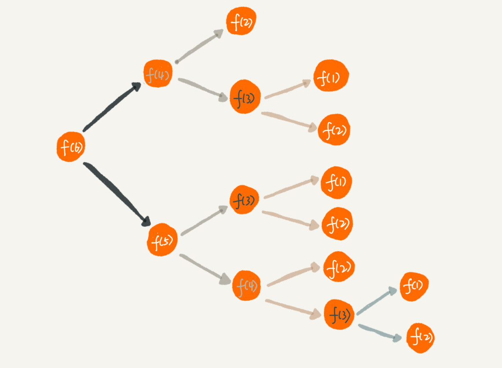

# 递归

递归(recursion)是指一种通过重复将问题分解为同类子问题而解决问题的方法.在程序中指的是函数自己调用自己,目的是将一个复杂且庞大的问题简单化,通过专注于解决小问题从而解决大问题,减少代码量.递和归.

## 递归需要满足的三个条件

一个问题满足下面三个条件时,可以使用递归的方法来解:

1. 一个问题的解可以分解为几个子问题的解

2. 这个问题与分解之后的子问题除了数据规模的不同,求解思路完全相同.

3. 存在递归终止条件

## 递归代码

递归代码的关键:**写出递推公式,找到终止条件**

举例说明:

假如这里有 n 个台阶，每次可以跨 1 个台阶或者 2 个台阶，请问走这 n 个台阶有多少种走法？

如果有 7 个台阶，你可以 2，2，2，1 这样子上去，也可以 1，2，1，1，2 这样子上去，总之走法有很多，那如何用编程求得总共有多少种走法呢？

```go
func climbStairs(n int) int {
    if n == 1 {
        return 1
    }
    if n ==2 {
        return 2
    }
    if n >2{
        return climbStairs(n-1)+climbStairs(n-2)
    }
    return 0
}
```

[示例代码](../leetCode/lc70/one/main.go)

在这个例子中满足三个条件,且递归终止条件是n==1或n==2.

写递归代码的关键就是找到如何将大问题分解为小问题的规律，并且基于此写出递推公式，然后再推敲终止条件，最后将递推公式和终止条件翻译成代码。

## 警惕堆栈溢出

函数的调用会使用栈来保存临时变量,每调用一个函数就会将临时变量封装为栈帧压入栈之中,等函数执行完之后出栈.

系统栈空间一般都不大,如果递归调用层次很深时,就会有堆栈溢出的风险.

### 避免堆栈溢出

* 限制调用深度 例如在上述例子中限制n<=40,如果n>40直接报错.

## 警惕重复计算

刚才的问题中对递归过程进行分解,过程如下图所示:



在图中可以看到,f(1),f(2),f(3)等被重复的计算多次,这种情况下可以使用一些变量或者常量对这些常见的返回值进行保存,避免重复计算.

```go
var HashClimbedStairs = make(map[int]int)

func climbStairs(n int) int {
	if n == 1 || n == 2 {
		return n
	}
	if HashClimbedStairs[n] == 0 {
		HashClimbedStairs[n] = climbStairs(n-1) + climbStairs(n-2)
	}

	return HashClimbedStairs[n]

}
```

[示例代码](../leetCode/lc70/two/main.go)

## 递归代码改为非递归代码

递归有利有弊，利是递归代码的**表达力很强**，**写起来非常简洁**；而弊就是**空间复杂度高、有堆栈溢出的风险、存在重复计算、过多的函数调用会耗时较多等问题**。所以，在开发过程中，我们要根据实际情况来选择是否需要用递归的方式来实现。


```go

func climbStairs(n int) int {
	if n == 1 || n == 2 {
		return n
	}
	res := 0
	prepre := 1	// 上上个台阶的方法
	pre := 2		//上一个台阶的方法
	for i := 3; i <= n; i++ {
		res = pre + prepre 
		prepre = pre
		pre = res
	}

	return res

}

```

笼统的讲,所有的递归代码都可以改写为迭代循环的非递归写法.