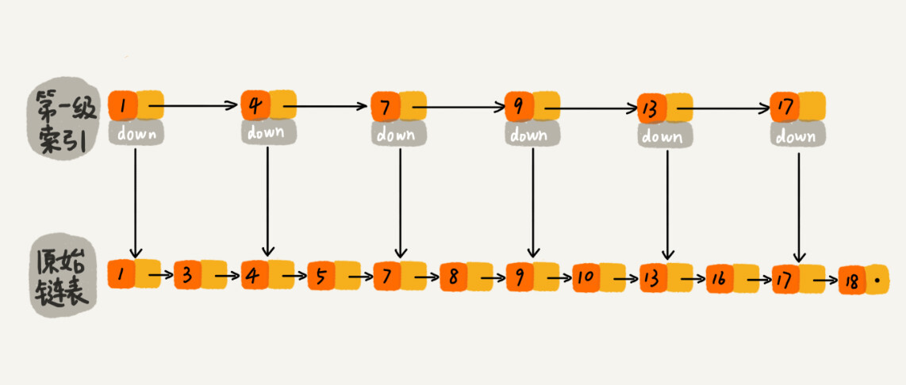
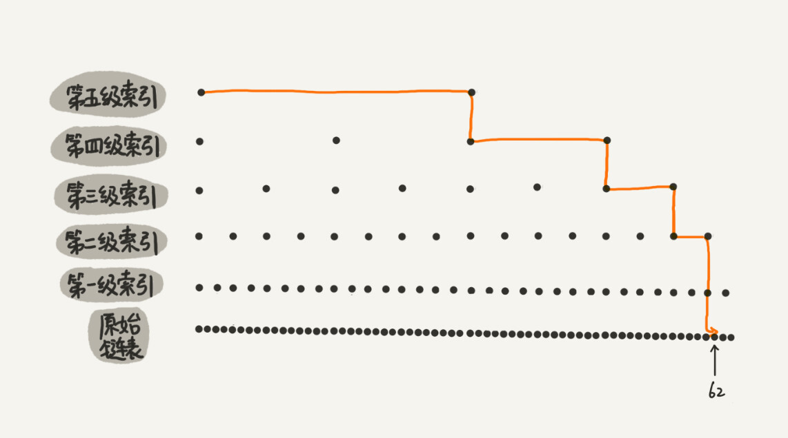

# 跳表

二分查找底层依赖的是数组随机访问的特性，所以只能用数组来实现。

如果数据存储在链表中,将链表改造为**跳表**这种数据结构即可实现类二分查找.

**跳表(Skip List)**是一个特殊的链表,有着更高的查找效率,可比拟二叉树查找,平均期望的查找,插入,删除操作的时间复杂度都是O(logn).是一种**随机化的数据结构(动态数据结构)**,实质上就是种可以进行二分查找的有序链表.

可以替代红黑树?

Redis中的有序集合就是用跳表(+散列表)来实现的.

Redis核心操作包括:

* 插入一个数据
* 删除一个数据
* 查找(更新)一个数据
* 按区间查找数据(例如:查找年龄在10-20岁之间的人)
* 迭代输出有序序列

其中插入,删除,更新和迭代输出有序序列这几个操作红黑树和跳表时间复杂度都是O(logn),而按区间查找数据红黑树的效率没有跳表高.

跳表更加灵活，它可以通过改变索引构建策略，有效平衡执行效率和内存消耗。

## 跳表的概念

对于一个存储着有序数据单链表来讲,平均查找时间复杂度是O(n),为了提高查找效率,可以对链表建立一个一级索引,其中down指针指向原始链表的某个节点,如下图所示:

如果我们要查找"16", 可以先在索引层遍历,当遍历到13时,发现下个结点的索引值是17,13<16<17,证明我们所要查找的内容可能存在于索引13的down指针指向的节点到索引17的down指针指向的节点之间.

这样只遍历了(5+2)个节点便找到了目标值.

同理,可以添加二级索引等等

这种链表加多级索引的结构，就是跳表。

## 跳表的特性

1. 查询,插入,删除任意数据的时间复杂度是O(logn)
2. 多出来的内存占用在实际开发中可以忽略,典型的空间换时间(跳表,双向链表)

## 索引的动态更新

跳表之所以称为动态数据结构,就是因为索引是需要根据链表进行更新.

当我们不停地往跳表中插入数据时，如果我们不更新索引，就有可能出现某两个索引结点之间数据非常多的情况。极端情况下，跳表还会退化成单链表。

更新方法:

当我们向跳表中插入数据的时候,可以选择同时将这个数据插入到部分的索引层中.我们通过一个随机函数，来决定将这个结点插入到哪几级索引中，比如随机函数生成了值 K，那我们就将这个结点添加到第一级到第 K 级这 K 级索引中。