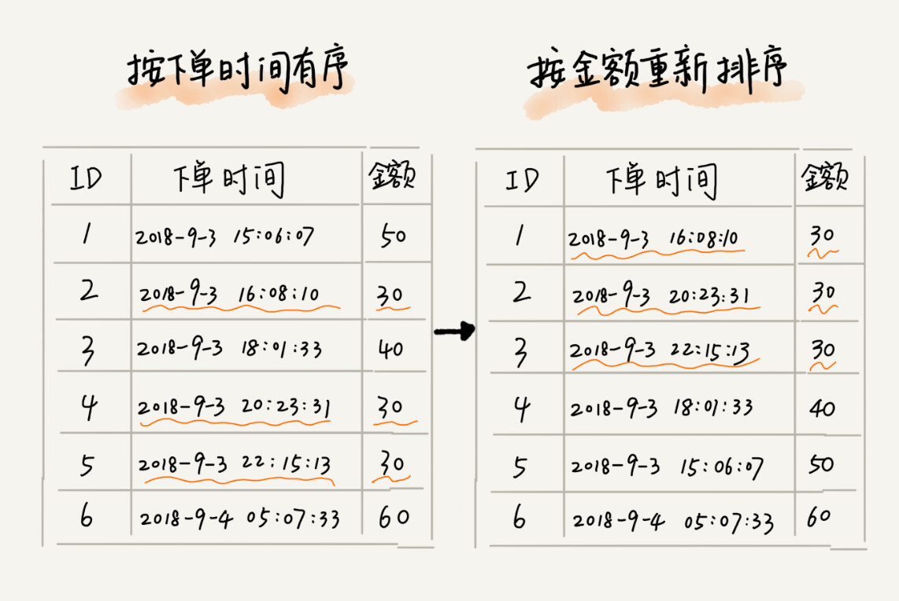

# 排序

排序是将一个数据元素（或记录）的任意序列，重新排列成一个关键字有序的序列.

经典的排序算法包括:`冒泡排序(Bubble Sort)`,`插入排序(Insertion Sort)`,`选择排序(Selection Sort)`,`归并排序(Merge Sort)`,`快速排序(Quick Sort)`,`计数排序(Counting Sort)`,`基数排序(Radix Sort)`,`桶排序(Bucket Sort)`.


## 如何分析一个排序算法

学习一个排序算法,除了了解其原理和代码实现之外,要学会如何评价和分析一个排序算法,分析这些方面:

### 排序算法的执行效率

排序算法的执行效率,一般从下面几个方向进行衡量:

1. 最好,最坏,平均情况时间复杂度

不同的数据(有的接近完全无序,有的接近有序),需要使用不同的算法.

2. 时间复杂度的系数,常数,低阶

大O法中的n为数据规模很大时候用来估计算法的时间消耗,但是在开发中,更多使用到的是小规模的数据,这时候系数,常数和低阶对时间复杂度的影响也不会低.

3. 比较次数和交换(移动)次数

当一个算法经常需要比较和移动,虽然其为O(1),但在实际开发中无法忽略.


### 排序算法的内存消耗

**原地排序**(Sort in place)指空间复杂度为O(1)的算法,不需要使用过多的额外空间,包括冒泡排序,插入排序,选择排序.

### 排序算法的稳定性

比如我们有一组数据 2，9，3(1)，4，8，3(2)，按照大小排序之后就是 2，3(1)，3(2)，4，8，9,一些算法会得到2，3(2)，3(1)，4，8，9.

稳定性即下一次排序依赖上一次稳定的结果.



## 冒泡排序

### 特性

最好情况:$$O(n)$$,数据已是顺序

最坏情况:$$O(n^2)$$,数据是逆序

平均情况:$$O(n^2)$$

空间复杂度:O(1),原地排序

稳定性:**稳定**,当遇到相同的值时,不做交换处理即可.

需要进行多次交换(读写)

### 动图演示


### 思想

1. 比较相邻的元素。如果第一个比第二个大，就交换它们两个；

2. 对每一对相邻元素作同样的工作，从开始第一对到结尾的最后一对，这样在最后的元素应该会是最大的数；

3. 针对所有的元素重复以上的步骤，除了最后一个；

4. 重复步骤1~3，直到排序完成。

### 代码

```go
func BubbleSort(ints []int) []int {
	length := len(ints)
	if length <= 1 {
		return ints
	}
	for i := 0; i < length; i++ {
		// 外层循环控制轮数
		for j := 0; j < length-i-1; j++ {
			// 内层循环控制每轮比较次数
			if ints[j] > ints[j+1] {
				ints[j], ints[j+1] = ints[j+1], ints[j]
			}
		}
	}
	fmt.Println("冒泡排序结束")
	return ints
}
```

[代码文件](bubble.go)

## 插入排序

### 特性

最好情况:$$O(n)$$,数据已是顺序,每次比较前一个元素时,都不需要交换位置.

最坏情况:$$O(n^2)$$,数据是逆序,每次都需要交换n次.

平均情况:$$O(n^2)$$

空间复杂度:O(1),原地排序

稳定性:**稳定**,当遇到相同的值时,不做交换处理即可.

需要进行多次交换(读写),相对于

### 动图演示


### 思想

1. 默认第一个元素已经默认在排好序的子集中了
2. 取出下一个元素A,与已经排好序的元素从后向前进行比较,如果元素B大于新元素A,则将B往后挪一个位置,直到已经到头或者元素B小于等于新元素A.
3. 重复操作2

插入排序中保证子集中的数据一定有序.

### 代码

```go
func InsertionSort(ints []int) []int {
   length := len(ints)
   // 默认第一个元素是有序的
   for i := 1; i < length; i++ {
      // 对每个元素进行一次插入操作
      preIndex := i - 1
      current := ints[i]
      for preIndex > 0 && current < ints[preIndex] {
         // 满足条件的则进行插入 从当前元素遍历到头或者碰到比他小的元素时停止
         ints[preIndex+1] = ints[preIndex]
         preIndex--
      }
      ints[preIndex+1] = current
   }
   fmt.Println("插入排序结束")
   return ints
}
```

[代码文件](insertion.go)

## 选择排序

### 特性

最好情况:$$O(n^2)$$

最坏情况:$$O(n^2)$$

平均情况:$$O(n^2)$$

空间复杂度:O(1),原地排序

稳定性:**不稳定**,选择排序每次都要找剩余未排序元素中的最小值，并和前面的元素交换位置，这样破坏了稳定性。比如 5，8，5，2，9 这样一组数据，使用选择排序算法来排序的话，第一次找到最小元素 2，与第一个 5 交换位置，那第一个 5 和中间的 5 顺序就变了，所以就不稳定了。正是因此，相对于冒泡排序和插入排序，选择排序就稍微逊色了。

### 动图演示


### 思想

1. 与插入排序相似,分为有序区和无序区,默认全集为无序区
2. 每一趟都在无序区找到一个最小值的下标插入到有序区后

插入排序中保证子集中的数据一定有序.

### 代码

```go
func SelectionSort(ints []int) []int {
	length := len(ints)
	if length < 2 {
		return ints
	}

	for i := 0; i < length; i++ {
		// 遍历所有
		minIndex := i
		changed := false
		for j := i + 1; j < length; j++ {
			// 未排序的子集
			if ints[minIndex] > ints[j] {
				changed = true
				minIndex = j
			}
		}
		if changed {
			ints[i], ints[minIndex] = ints[minIndex], ints[i]
		}
	}
	fmt.Println("选择排序结束")
	return ints
}
```

[代码文件](selection.go)

## 归并排序

二路归并排序

### 特性

最好情况:$$O(nlogn)$$

最坏情况:$$O(nlogn)$$

平均情况:$$O(nlogn)$$

空间复杂度:O(n),非原地排序

稳定性:**稳定**,在merge阶段可以对相同值选择进行排序.

### 动图演示


### 思想

归并排序分为分解与合并两个过程.

使用了[分治](../divideAndConquer/readme.md)的思想

> 分治即将大问题分解为小问题,小问题解决了,大问题也就解决了.
>
> 分治思想与递归思想很像,一般分治算法都使用递归来实现.
>
> **分治是解决问题的思路,递归是编程技巧**


### 代码

```go
func MergeSort(ints []int) {
	sort(ints, 0, len(ints)-1)
}

func sort(ints []int, start int, end int) {
	if start >= end {
		return
	}
	mid := (end + start) / 2
	fmt.Println("排序", start, "到", mid)
	sort(ints, start, mid)
	fmt.Println("排序", mid+1, "到", end)
	sort(ints, mid+1, end)
	merge(ints, start, mid, end)

}

func merge(ints []int, start int, mid int, end int) {
	fmt.Printf("合并[%d:%d]与[%d:%d]到[%d,%d]\n", start, mid, mid+1, end, start, end)
	tmp := make([]int, 0)
out:
	for i := start; i <= mid; {
		for j := mid + 1; j <= end; {
			if ints[i] > ints[j] {
				tmp = append(tmp, ints[j])
				j++
				if j > end {
					tmp = append(tmp, ints[i:mid+1]...)
					break out
				}
			} else {
				tmp = append(tmp, ints[i])
				i++
				if i > mid {
					tmp = append(tmp, ints[j:end+1]...)
					break out
				}
			}
		}
	}
	i, j := start, 0
	for i <= end {
		ints[i] = tmp[j]
		i++
		j++
	}

}
```

[代码文件](merge.go)

## 快速排序

### 特性

最好情况:$$O(nlogn)$$

最坏情况:$$O(n^2)$$,如果数组中的数据原来已经是有序的了，比如 1，3，5，6，8。如果我们每次选择最后一个元素作为 pivot，那每次分区得到的两个区间都是不均等的。我们需要进行大约 n 次分区操作，才能完成快排的整个过程。每次分区我们平均要扫描大约 n/2 个元素，这种情况下，快排的时间复杂度就从 O(nlogn) 退化成了 O(n2)。

平均情况:$$O(n^2)$$

空间复杂度:O(1),原地排序

稳定性:**稳定**

### 动图演示


### 思想

1. 从数列中挑出一个元素,成为基准(pivot)
2. 重新排列数列,所有比基准小的元素和比基准大的元素分区排放,每次排列确定一个元素的位置,获得两个分区
3. 在两个分区中分别重复步骤2

### 代码

```go
func QuickSort(ints []int) []int {
	if len(ints) < 2 {
		return ints
	}

	pivot := ints[0]
	less := make([]int, 0)
	greater := make([]int, 0)
	for _, v := range ints[1:] {
		if v <= pivot {
			less = append(less, v)
		} else {
			greater = append(greater, v)
		}
	}
	less = QuickSort(less)
	greater = QuickSort(greater)

	return append(append(less, pivot), greater...)
}
```

[代码文件](quick.go)

从代码中可以看到 快排的处理是由上到下的,先作比较,再处理子问题(后迭代)

而归并的处理是由下到上的,先处理子问题,再进行比较(先迭代)

