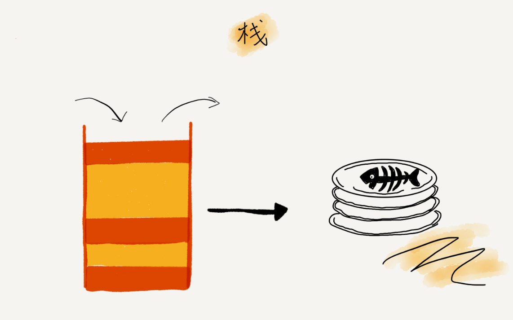

# 栈

`栈（Stack）`是**只允许在一端**进行插入或删除操作的线性表(操作受限的线性表)。这一端被称为`栈顶(Top)`，相对地，把另一端称为`栈底(Bottom)`。

向一个栈插入新元素又称作`进栈、入栈或压栈(Push)`，它是把新元素放到栈顶元素的上面，使之成为新的栈顶元素.

从一个栈删除元素又称作`出栈或退栈(Pop)`.



栈的特性即**先进后出**(Last In First Out ,LIFO).

从功能上来讲,数组和链表确实可以替代栈,但是特定的数据结构是对特定场景的抽象,数组与链表暴露了太多了操作接口.

## 如何实现一个栈

在实际中,栈的实现使用数组或者链表,使用数组实现的栈叫做顺序栈,使用链表实现的栈叫做链式栈.

栈的实现只需要实现两个方法,即Pop和Push即可.

下面是使用java和go实现的栈.

```java
public class ArrayStack{
  private String[] items; 	// 数组
  private int count; 				// 栈中元素个数
  private int n; 						// 栈的大小
  
  // 初始化大小
  public ArrayStack(int n){
    this.items = new String[n];
    this.n = n;
    this.count = 0;
  }
  
  // 入栈
  public boolean push(String item){
    if (count == n) return false; //满了
    items[count] = item;
    ++count;
    return true;
  }
  
  //出栈
  public String pop(){
    if (count == 0 ) return null;// 空栈
    String tmp = items[count-1];
    --count;
    return tmp;
  }
}
```

```go
package stack


import (
	"errors"
	"fmt"
)

//type IntStack interface {
//	Push(int) error
//	Pop() (int error)
//}

type intStack struct {
	data []int64
	Len  int
	Cap  int
}

func (stack *intStack) Push(input int64) error {
	if stack.Len == stack.Cap {
		// 如果支持动态栈 删掉这个代码即可
		return errors.New("栈满")
	}

	stack.data = append(stack.data, input)

	if stack.Len == stack.Cap {
		stack.Cap = cap(stack.data) // 如果支持动态栈
		fmt.Println("栈已扩容")
	}
	stack.Len += 1
	fmt.Printf("push元素%d成功,当前栈的容量%d,当前长度%d\n", input, stack.Cap, stack.Len)
	return nil
}
func (stack *intStack) Pop() (int64, error) {
	if stack.Len == 0 {
		return -1, errors.New("栈空")
	}
	tmp := stack.data[stack.Len-1]
	stack.data = stack.data[:stack.Len-1]
	stack.Len -= 1
	fmt.Printf("pop出%d成功,当前栈的容量%d,当前长度%d\n", tmp, stack.Cap, stack.Len)
	return tmp, nil
}

// NewIntStack 设置一个方法返回一个栈
func NewIntStack(cap int) (*intStack, error) {
	if cap <= 0 {
		return nil, errors.New("cap应该大于0")
	}

	fmt.Printf("新建stack成功,cap=%d\n", cap)

	return &intStack{
		data: make([]int64, 0, cap),
		Len:  0,
		Cap:  cap,
	}, nil
}


```

通过代码可以看出,不管是顺序栈还是链式栈,Pop与Push操作仅在栈顶进行操作,时间复杂度皆为O(1).

[Go语言示例代码](stack.go)

## 栈的使用

栈最多使用在如下的场景中:

* 函数调用栈
* 表达式求值(后缀表达式)
* 括号匹配

## 内存的堆栈与代码的栈的区别

内存中的堆栈和数据结构堆栈不是一个概念，可以说内存中的堆栈是真实存在的物理区，数据结构中的堆栈是抽象的数据存储结构。 

内存空间在逻辑上分为三部分：代码区、静态数据区和动态数据区，动态数据区又分为栈区和堆区。 

* 代码区：存储方法体的二进制代码。高级调度（作业调度）、中级调度（内存调度）、低级调度（进程调度）控制代码区执行代码的切换。
* 静态数据区：存储全局变量、静态变量、常量，常量包括final修饰的常量和String常量。系统自动分配和回收。 
* 栈区：存储运行方法的形参、局部变量、返回值。由系统自动分配和回收。
* 堆区：new一个对象的引用或地址存储在栈区，指向该对象存储在堆区中的真实数据。
